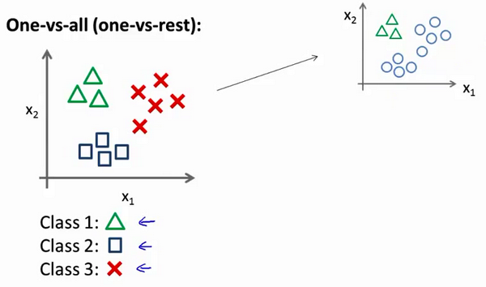
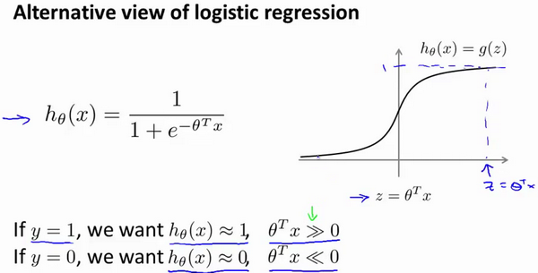

# 参考资料

* [[中英字幕]吴恩达机器学习系列课程_哔哩哔哩_bilibili](https://www.bilibili.com/video/BV164411b7dx?spm_id_from=333.337.search-card.all.click)
* [Machine Learning by Stanford University | Coursera](https://www.coursera.org/learn/machine-learning/home/welcome)
* [fengdu78/Coursera-ML-AndrewNg-Notes: 吴恩达老师的机器学习课程个人笔记 (github.com)](https://github.com/fengdu78/Coursera-ML-AndrewNg-Notes)
* [3Blue1Brown的个人空间_哔哩哔哩_bilibili](https://space.bilibili.com/88461692)

# 引言

## 机器学习的定义

一个程序被认为能从经验E中学习，解决任务T，达到性能度量值P，当且仅当，有了经验E后，经过P评判，程序在处理T时的性能有所提升。

## 监督学习

我们给学习算法一个数据集，它由“正确答案”组成。

1. 回归：试着推测出这一系列连续值属性

    
2. 分类：

    

## 无监督学习

不提供“正确答案”。


# 单变量线性回归

## 线性回归模型


**预测函数：**$h_\theta \left( x \right)=\theta_{0}+\theta_{1}x$

**代价函数：**$J \left( \theta_0, \theta_1 \right) = \frac{1}{2m}\sum\limits_{i=1}^m \left( h_{\theta}(x^{(i)})-y^{(i)} \right)^{2}$

三维图


等高线图


## 梯度下降


算法

> repeat until convergence {
>
> $\theta_{j}:=\theta_{j}-\alpha \frac{\partial}{\partial \theta_{j}} J\left(\theta_{0}, \theta_{1}\right) \quad(\text { for } j=0 \text { and } j=1)$
>
> }
>

**之所以要减去一个正数乘以偏导，是为了让它在函数趋于平缓时下降也变慢，避免降过头**

其中$\alpha$为学习率，其设置应当适中。太小收敛就太慢，太大就可能越过最低点甚至无法收敛。

# 多变量线性回归

## 多变量线性回归模型

**多维特征：**房子价格、卧室数量、楼层数量等。表示为$X = \left( {x_{1}},{x_{2}},...,{x_{n}} \right)$

**预测函数：**${h_{\theta}}\left( x \right)={\theta^{T}}X={\theta_{0}}{x_{0}}+{\theta_{1}}{x_{1}}+{\theta_{2}}{x_{2}}+...+{\theta_{n}}{x_{n}}$

**代价函数：**$J\left( \theta  \right)=\frac{1}{2m}\sum\limits_{i=1}^{m}{{{\left( {h_{\theta}}\left( {x^{(i)}} \right)-{y^{(i)}} \right)}^{2}}}$

## 多变量梯度下降

**算法：**

> repeat until convergence{
>
> $\theta_{\mathrm{j}}:=\theta_{\mathrm{j}}-\alpha \frac{\partial}{\partial \theta_{j}} \mathrm{~J}\left(\theta_{0}, \theta_{1}, \ldots, \theta_{\mathrm{n}}\right)$
>
> i.e.,
>
> ${{\theta }_{j}}:={{\theta }_{j}}-\alpha\frac{1}{m}\sum\limits_{i=1}^{m}{({{h}_{\theta }}({{x}^{(i)}})-{{y}^{(i)}})}x_{j}^{(i)}$
>
> }
>

<u>注意：是在一次迭代中同时更新全部的参数，而不是在同一次迭代中就把之前更新过的参数用进去，这个错误在写程序的时候尤其容易犯。</u>

## 梯度下降最佳实践

**特征缩放**

* 要保证这些特征都具有相近的尺度，这将帮助梯度下降算法更快地收敛
* 令${{x}_{n}}=\frac{{{x}_{n}}-{{\mu}_{n}}}{{{s}_{n}}}$，其中$μ_n$是平均值，${s_{n}}$是标准差

**学习率设置**

* 绘制迭代次数和代价函数的图表来观测算法在何时趋于收敛

  
* 尝试$\alpha=0.01，0.03，0.1，0.3，1，3，10$，每次乘以/除以$\sqrt{10}$

## 特征和多项式回归模型

线性回归并不适用于所有数据，有时我们需要曲线来适应我们的数据，比如一个二/三次方模型。**我们可以把它们转换为线性回归模型。**

如$h_{\theta}\left( x \right)={\theta_{0}}+{\theta_{1}}{x_{1}}+{\theta_{2}}{x_{2}^2}+{\theta_{3}}{x_{3}^3}$

我们可以直接令${{x}_{2}}=x_{2}^{2},{{x}_{3}}=x_{3}^{3}$

## 正规方程

线性代数知识：最小二乘解

$\theta ={{\left( {X^T}X \right)}^{-1}}{X^{T}}y$

优点：准确方便，不需要设置参数，一次运算即可得到

缺点：

* 计算${{\left( {{X}^{T}}X \right)}^{-1}}$的复杂度为$O\left( {{n}^{3}} \right)$，一般$n<10000$
* 只适用于线性模型，不适合逻辑回归模型等其他模型

不可逆性的疑问

* ${{X}^{T}}X$可能不可逆
* 可用`pinv(X'*X)`得到伪逆矩阵，正规方程结果依然是正确的
* 可能原因

  * 两个特征线性相关
  * 特征数量相对与数据量过多

# 逻辑回归

## 分类问题

y值离散，不再适用线性回归，因为线性回归的预测值包含很多0/1之外的值，即使设置阈值来强行规定，**曲线也会因为一些极端数据而很大变化**。


## 逻辑回归模型

### 预测函数

预测函数：$h_\theta \left( x \right)=g\left(\theta^{T}x \right)$

其中逻辑函数：$g\left( z \right)=\frac{1}{1+{{e}^{-z}}}$

（逻辑函数即logistic函数，也称sigmoid函数）

注意：$h_\theta \left( x \right)=P\left( y=1|x;\theta \right)$，表示**可能性**


0和1的预测以$y=0.5$为分界，也就是以$\theta^{T}X=z=0$为分界


若$\theta=\begin{matrix}[-3 & 1 & 1]\end{matrix}$

$-3+{x_1}+{x_2} \geq 0$

分界线非常自然


对于分界线是曲线的模型可以引入高次项

${h_\theta}\left( x \right)=g\left( {\theta_0}+{\theta_1}{x_1}+{\theta_{2}}{x_{2}}+{\theta_{3}}x_{1}^{2}+{\theta_{4}}x_{2}^{2} \right)$

$\theta=\begin{matrix}[-1 & 0 & 0 & 1 & 1]\end{matrix}$

### 代价函数

传统代价函数$J \left( \theta_0, \theta_1 \right) = \frac{1}{2m}\sum\limits_{i=1}^m \left( h_{\theta}(x^{(i)})-y^{(i)} \right)^{2}$不再有效,因为它会是一个非凸函数（non-convexfunction）

注意：本处“凸函数”，从英美定义，指U型函数


**新代价函数：**$J\left( \theta  \right)=\frac{1}{m}\sum\limits_{i=1}^{m}{{Cost}\left( {h_\theta}\left( {x}^{\left( i \right)} \right),{y}^{\left( i \right)} \right)}$

其中$\operatorname{Cost}\left(h_{\theta}(x), y\right)=\left\{\begin{aligned} -\log \left(h_{\theta}(x)\right) & \text { if } y=1 \\ -\log \left(1-h_{\theta}(x)\right) & \text { if } y=0 \end{aligned}\right.$


这样构建的$Cost\left( {h_\theta}\left( x \right),y \right)$函数的特点是：当实际的  $y=1$ 且${h_\theta}\left( x \right)$也为 1 时误差为 0，当 $y=1$ 但${h_\theta}\left( x \right)$不为1时误差随着${h_\theta}\left( x \right)$变小而变大；当实际的 $y=0$ 且${h_\theta}\left( x \right)$也为 0 时代价为 0，当$y=0$ 但${h_\theta}\left( x \right)$不为 0时误差随着 ${h_\theta}\left( x \right)$的变大而变大。非常优秀。

化简合并这个分段函数得到

$Cost\left( {h_\theta}\left( x \right),y \right)=-y\times log\left( {h_\theta}\left( x \right) \right)-(1-y)\times log\left( 1-{h_\theta}\left( x \right) \right)$

$J\left( \theta  \right)=-\frac{1}{m}\sum\limits_{i=1}^{m}{[{{y}^{(i)}}\log \left( {h_\theta}\left( {{x}^{(i)}} \right) \right)+\left( 1-{{y}^{(i)}} \right)\log \left( 1-{h_\theta}\left( {{x}^{(i)}} \right) \right)]}$

### 代码

```matlab
function g = sigmoid(z)
%sigmoid函数
g = 1 ./ (1+exp(-z));
end

function [J, grad] = costFunction(theta, X, y)
m = length(y);
h = sigmoid(X * theta); %预测函数
J = -1/m * sum(y .* log(h) + (1-y) .* log(1-h)); %代价函数
grad = 1/m * sum((h-y) .* X); %代价函数的偏导
end
```

## 梯度下降

> Repeat {
> ​$\theta_j := \theta_j - \alpha \frac{\partial}{\partial\theta_j} J(\theta)$
>
> i.e.,
>
> $\theta_j := \theta_j - \alpha \frac{1}{m}\sum\limits_{i=1}^{m}{{\left( {h_\theta}\left( \mathop{x}^{\left( i \right)} \right)-\mathop{y}^{\left( i \right)} \right)}}\mathop{x}_{j}^{(i)}$
> **(simultaneously update all)**
> }
>

注意：虽然很巧和地看起来和线性回归的梯度下降一样，但实际上不一样，因为${h_\theta}\left( x \right)=g\left( {\theta^T}x \right)$

（注意：这里的$x$是向量，如果用$X_{m\times n}$表示矩阵，那可以用$g(X\theta)$）

其它梯度下降技巧同样适用

## 高级方法

这些算法更加复杂和优越，而且通常不需要人工选择学习率，通常比梯度下降算法要更加快速。这些算法有：**共轭梯度**（**Conjugate Gradient**），**局部优化法**(**Broyden fletcher goldfarb shann,BFGS**)和**有限内存局部优化法**(**LBFGS**)

```matlab
%事实上这是Octave代码，但也适用MATLAB
function [jVal, gradient] = costFunction(theta, X, y)

    jVal = [...code to compute J(theta)...];
    gradient = [...code to compute derivative of J(theta)...];
  
end

X = [...code to initialize X...];
y = [...code to initialize y...];

options = optimoptions(@fminunc,'Algorithm','Quasi-Newton','GradObj', 'on', 'MaxIter', 400);
%By setting 'GradObj'to 'on', we tell fminunc that our function returns both the cost and the gradient
%By setting 'MaxIter'to '400', we tell fminunc that it should run for at most 400 steps before it terminates
  
initialTheta = [...code to initialize theta...];
% like seros(3,1)
  
[theta, cost] = fminunc(@(t)(costFunction(t,X,y)), initialTheta, options);
%匿名函数
```

## 一对多分类


如何把“一对多”转化为“一对一”？“一对余”思想



$h_\theta^{\left( i \right)}\left( x \right)=p\left( y=i|x;\theta  \right), i=1, 2, 3, ..., k$

在我们需要做预测时，我们将所有的分类机都运行一遍，然后对每一个输入变量，都选择最高可能性的输出变量，也就是$\mathop{\max}\limits_i\,h_\theta^{\left( i \right)}\left( x \right)$。

# 正则化

## 欠拟合与过拟合


过拟合的问题往往是由高次项系数过大产生，所以应对此施加惩罚

修改代价函数来限制高次项系数如$\underset{\theta }{\mathop{\min }}\,\frac{1}{2m}[\sum\limits_{i=1}^{m}{{{\left( {{h}_{\theta }}\left( {{x}^{(i)}} \right)-{{y}^{(i)}} \right)}^{2}}+1000\theta _{3}^{2}+10000\theta _{4}^{2}]}$

新代价函数：$J\left( \theta  \right)=\frac{1}{2m}[\sum\limits_{i=1}^{m}{{{({h_\theta}({{x}^{(i)}})-{{y}^{(i)}})}^{2}}+\lambda \sum\limits_{j=1}^{n}{\theta_{j}^{2}}]}$

：**注意：不包括${\theta_{0}}$**

$\lambda$称为正则化参数


注意：过大的$\lambda$可能导致欠拟合

正则化线性回归

### 梯度下降

（注意：我们没有对$\theta_0$进行正则化，所以要分两类讨论）

Repeat until convergence{

${\theta_0}:={\theta_0}-a\frac{1}{m}\sum\limits_{i=1}^{m}{(({h_\theta}({{x}^{(i)}})-{{y}^{(i)}})x_{0}^{(i)}})$

${\theta_j}:={\theta_j}-a[\frac{1}{m}\sum\limits_{i=1}^{m}{(({h_\theta}({{x}^{(i)}})-{{y}^{(i)}})x_{j}^{\left( i \right)}}+\frac{\lambda }{m}{\theta_j}]\quad for\quad  j=1,2,...,n$

}

### 正规方程


$\theta ={{\left( {X^T}X +\lambda (I-A)\right)}^{-1}}{X^{T}}y$

其中$I$为$(n+1)\times(n+1)$的，$A$只有左上角为1，其余为0

## 正则化逻辑回归

新代价函数：$J\left( \theta  \right)=\frac{1}{m}\sum\limits_{i=1}^{m}{[-{{y}^{(i)}}\log \left( {h_\theta}\left( {{x}^{(i)}} \right) \right)-\left( 1-{{y}^{(i)}} \right)\log \left( 1-{h_\theta}\left( {{x}^{(i)}} \right) \right)]}+\frac{\lambda }{2m}\sum\limits_{j=1}^{n}{\theta _{j}^{2}}$

梯度下降算法：

Repeat until convergence{

${\theta_0}:={\theta_0}-a\frac{1}{m}\sum\limits_{i=1}^{m}{(({h_\theta}({{x}^{(i)}})-{{y}^{(i)}})x_{0}^{(i)}})$

${\theta_j}:={\theta_j}-a[\frac{1}{m}\sum\limits_{i=1}^{m}{({h_\theta}({{x}^{(i)}})-{{y}^{(i)}})x_{j}^{\left( i \right)}}+\frac{\lambda }{m}{\theta_j}]\quad for \quad j=1,2,...,n$

}

看上去依旧和线性回归一样，但实际还是不同

```matlab
function g = sigmoid(z)
%sigmoid函数
g = 1 ./ (1+exp(-z));
end

function [J, grad] = costFunction(theta, X, y)
m = length(y);
h = sigmoid(X * theta); %预测函数
J = 1/m * sum(-y .* log(h) - (1-y) .* log(1-h)) + lambda / (2*m) * (sum(theta.^2) - (theta(1))^2); %代价函数
grad = 1/m * X' * (h-y) + lambda/m * theta; %代价函数的偏导
grad(1) = grad(1) - lambda/m * theta(1); %分类讨论
end
```

# 神经网络

## 引入

非线性假设

无论是线性回归还是逻辑回归都有这样一个缺点，即：当特征太多时，计算的负荷会非常大


大脑的特点：给听觉中枢输入视觉信号，听觉中枢能够学会“看”

## 前向传播算法


$a_{1}^{(2)}=g(\Theta _{10}^{(1)}{{x}_{0}}+\Theta _{11}^{(1)}{{x}_{1}}+\Theta _{12}^{(1)}{{x}_{2}}+\Theta _{13}^{(1)}{{x}_{3}})$
​$a_{2}^{(2)}=g(\Theta _{20}^{(1)}{{x}_{0}}+\Theta _{21}^{(1)}{{x}_{1}}+\Theta _{22}^{(1)}{{x}_{2}}+\Theta _{23}^{(1)}{{x}_{3}})$
​$a_{3}^{(2)}=g(\Theta _{30}^{(1)}{{x}_{0}}+\Theta _{31}^{(1)}{{x}_{1}}+\Theta _{32}^{(1)}{{x}_{2}}+\Theta _{33}^{(1)}{{x}_{3}})$
​${{h}_{\Theta }}(x)=g(\Theta _{10}^{(2)}a_{0}^{(2)}+\Theta _{11}^{(2)}a_{1}^{(2)}+\Theta _{12}^{(2)}a_{2}^{(2)}+\Theta _{13}^{(2)}a_{3}^{(2)})$

**一般地，**$a^{(l+1)}=g(\Theta^{(l)}[1; a^{(l)}])$

注意：每一层都有一个偏置项，值为1


通过AND、(NOT A) AND (NOT B)以及OR复合得到A NOR B，非常神奇


多类分类


## 代价函数


逻辑回归代价函数：$J\left( \theta  \right)=\frac{1}{m}\sum\limits_{i=1}^{m}{[-{{y}^{(i)}}\log \left( {h_\theta}\left( {{x}^{(i)}} \right) \right)-\left( 1-{{y}^{(i)}} \right)\log \left( 1-{h_\theta}\left( {{x}^{(i)}} \right) \right)]}+\frac{\lambda }{2m}\sum\limits_{j=1}^{n}{\theta _{j}^{2}}$

神经网络代价函数：$J(\Theta) = -\frac{1}{m} \left[ \sum\limits_{i=1}^{m} \sum\limits_{k=1}^{K} {y_k}^{(i)} \log {(h_\Theta(x^{(i)}))}_k + \left( 1 - y_k^{(i)} \right) \log \left( 1- {\left( h_\Theta \left( x^{(i)} \right) \right)}_k \right) \right] + \frac{\lambda}{2m} \sum\limits_{l=1}^{L-1} \sum\limits_{i=1}^{s_l} \sum\limits_{j=1}^{s_{l+1}} \left( \Theta_{ij}^{(l)} \right)^2$

其中$n$为变量数量，$m$为数据数量，$K$为分类数量，$L$为神经网络层数，$s_l$表示第$i$层的神经元数量，$(h_{\Theta}(x^{(i)}))_k \isin \mathbb{R}$表示第$i$个输出

$\Theta_{ij}^{(l)}$表示神经网络的第$l$层的第$j$个神经元到第$l+1$层的第$i$个神经元的系数**（没错，是后一层在前，前一层在后，目的是便于矩阵计算）**，$i = 0,1,...,s_l \quad j=1,2,...,s_{l+1}$。也就是说每层$l$都会有这么一个$s_{l+1}\times (s_l+1)$的矩阵$\Theta^{(l)}$，作为变换矩阵把这一层的向量映射到下一层

**注意：这里依旧没有惩罚偏置项**，也就是说$i$是从1开始而不是0开始

## 反向传播算法

### 算法综述

如何求偏导$\frac{\partial}{\partial\Theta^{(l)}_{ij}}J\left(\Theta\right)$？反向传播算法


算法

> Set $\Delta_{ij}^{(l)}=0$ for all $l, i, j$
>
> For $t=1:m$ {
>
> #注意：$i$表示数据编号，是独立于某个网络之外的
>
> Set $a^{(1)}=x^{(t)}$
>
> Perform foward prepagation to compute $a^{(i)}$ for $l=1,2,3,...,L$
>
> Using $y^{(t)}$, compute $\delta^{(L)}=a^{(L)}-y^{(t)}$
>
> Using $\delta^{(l)}=\left({\Theta^{(l)}}\right)^{T}\delta^{(l+1)}.\ast g'\left(z^{(l)}\right)$ and $g'(z^{(l)})=a^{(l)}\ast(1-a^{(l)})$, compute $\delta^{(L-1)},\delta^{(L-2)},...,\delta^{(2)}$
>
> $\Delta_{ij}^{(l)}:=\Delta_{ij}^{(l)}+a_j^{(l)}\delta_i^{(l+1)}$
>
> }
>
> $D_{ij}^{(l)} :=\frac{1}{m}\Delta_{ij}^{(l)}+\lambda\Theta_{ij}^{(l)} \quad if\;j \neq 0$
>
> $D_{ij}^{(l)} :=\frac{1}{m}\Delta_{ij}^{(l)} \quad if\; j=0$
>

### 直观理解


### 一些运算细节

参考[【官方双语】深度学习之反向传播算法 上/下 Part 3 ver 0.9 beta_哔哩哔哩_bilibili](https://www.bilibili.com/video/BV16x411V7Qg?p=2)

考虑第$L-1$层

由链式法则

$\frac{\partial J\left(\Theta\right)}{\partial \Theta^{(L-1)}_{ij}}=\frac{\partial z_i^{(L)}}{\partial \Theta^{(L-1)}_{ij}} \frac{\partial a_i^{(L)}}{\partial z_i^{(L)}} \frac{\partial J\left(\Theta\right)}{\partial a_i^{(L)}}$

而

$J(\Theta)=\sum\limits_{i=1}^{s_L}(a_i^{(L)}-y_i)^2$

$\frac{\partial J\left(\Theta\right)}{\partial a_i^{(L)}}=2(a_i^{(L)}-y_i)$

（此处用普通的代价函数便于计算）

$a_i^{(L)}=g(z_i^{(L)})$

$z_i^{(L)}=...+\Theta_{ij}^{(L-1)}a_j^{(L-1)}+...$

代入即可

对于前$L-1$层，可以以此类推

考虑第$L-1$层的第$j$个节点

$\frac{\partial J(\Theta)}{\partial a_{j}^{(L-1)}}=\sum\limits_{i=1}^{n_{L}} \frac{\partial z_{i}^{(L)}}{\partial a_{j}^{(L-1)}} \frac{\partial a_{i}^{(L)}}{\partial z_{i}^{(L)}} \frac{\partial  J(\Theta)}{\partial a_{i}^{(L)}}$

也都很好求

## 最佳实践

### 矩阵与向量的互相转化

一些MATLAB内置的高级最优化函数要求输入为向量，如`optTheta = fminunc(@costFunction, initialTheta, options)`因此需要向量和矩阵的互相转化

```matlab
A1 = [1 2 3; 4 5 6; 7 8 9];
A2 = [9 8 7; 6 5 4; 3 2 1];
vecA = [A1(:); A2(:)];
% Mat to Vec

B1 = reshape(vecA(1:9), 3, 3);
B2 = reshape(vecA(10:18), 3, 3);
% Vec to Mat
```

### 梯度检验

神经网络编写复杂，易出现bug，建议进行梯度检验，即直接暴力求出偏导值，与反向传播算法的结果进行对照。如$\frac{\partial}{\partial\theta_1}=\frac{J\left(\theta_1+\varepsilon_1,\theta_2,\theta_3...\theta_n \right)-J \left( \theta_1-\varepsilon_1,\theta_2,\theta_3...\theta_n \right)}{2\varepsilon}$

```matlab
EPSILON = 10^(-4);
for i = 1:n
    thetaPlus = theta;
    thetaPlus(i) - cnetaPlus(i) + EPSILON;
    thetaMinus = theta;
    thetaMinus(i) = the taMinus(i) - EPSILON;
    gradApprox(i) = (J(thetaPlus) - J(thetaMinus)) / (2*EPSILON);
end
% Check whether gradApprox approximates DVec
```

### 随机初始化


将参数初始化为0在神经网络中会导致权重对称问题，也就是某一对参数始终相等。因此我们要随机初始化参数，使得$\theta_i \isin (-\epsilon,\epsilon)$

```matlab
a = 10; b = 11;
Theta1 = rand(a, b) * (2*EPSILON) – EPSILON;
```

## 小结

训练神经网络

1. 随机初始化参数
2. 利用正向传播方法计算所有的$h_{\Theta}(x)$
3. 编写计算代价函数$J(\Theta)$的代码
4. 利用反向传播方法计算所有偏导数
5. 利用数值检验方法检验这些偏导数
6. 使用优化算法来最小化代价函数

# 应用机器学习的建议

## 假设评估

如何评估假设是否优秀？

训练集70%+测试集30%

**（注意：随机选择）**

线性回归测试集代价函数：$J_{test}\left( \theta  \right)=\frac{1}{2m_{test}}\sum\limits_{i=1}^{m_{test}}{{{\left( {h_{\theta}}\left( {x_{test}^{(i)}} \right)-{y_{test}^{(i)}} \right)}^{2}}}$

逻辑回归测试集代价函数：$J_{test}{(\theta)} = -\frac{1}{{m}_{test}}\sum\limits_{i=1}^{m_{test}}\log{h_{\theta}(x^{(i)}_{test})}+(1-{y^{(i)}_{test}})\log{h_{\theta}(x^{(i)}_{test})}$

或者用**误判率**来代替这种分类问题的代价函数

$\operatorname{err}\left(h_{\theta}(x), y\right)=\left\{\begin{array}{c} 1 \quad\text { if } h(x) \geq 0.5 \text { and } y=0, \text { or if } h(x)<0.5 \text { and } y=1 \\ 0 \quad\text { Otherwise } \end{array}\right.$

$J_{test}{(\theta)} = \frac{1}{2m_{test}}\sum\limits_{i=1}^{m_{test}}\text{err}(h_\theta(x),y)$

## 模型选择和交叉验证集

基于上文，我们可以选择在测试集上表现最好的模型作为我们的预测模型

然而，考虑到预测模型的选择实际上是基于测试集做出的判断，因此“选择模型”的参数实际上在测试集上训练了，不能真实反映其能力

引入**交叉验证集**（Cross Validation，简称cv）

训练集60%+交叉训练集20%+测试集20%

$J_{train}(\theta) = \frac{1}{2m}\sum\limits_{i=1}^{m}(h_{\theta}(x^{(i)})-y^{(i)})^2$

$J_{cv}(\theta) = \frac{1}{2m_{cv}}\sum\limits_{i=1}^{m}(h_{\theta}(x^{(i)}_{cv})-y^{(i)}_{cv})^2$

$J_{test}(\theta)=\frac{1}{2m_{test}}\sum\limits_{i=1}^{m_{test}}(h_{\theta}(x^{(i)}_{test})-y^{(i)}_{test})^2$

注意：测试集和验证集都不进行正则化

## 诊断偏差和方差

偏差（Bias）：欠拟合

 方差（Variance）：过拟合


模型的选择影响欠拟合/过拟合情况

欠拟合->正好->过拟合


## 正则化和偏差/方差

正则化参数影响欠拟合/过拟合情况


## 学习曲线

**非常重要的判断目前是欠拟合还是过拟合的方法**

从$m=1$开始不断增加数据量

则$J_{train}(\Theta)$不断变大，因为数据增多，越来越不能完美拟合

$J_{cv}(\Theta)$（事实上，$J_{test}(\Theta)$也一样）不断变小，因为预测模型越来越接近真实情况

正好


欠拟合

两个函数很接近，意味着增加数据对模型提示水平没有意义


过拟合

两个函数随数据增多有很大的接近空间，意味着增加数据量很有意义


## 解决办法

|方法|解决|
| --------------------| ------|
|获得更多的训练样本|过拟合|
|尝试减少特征的数量|过拟合|
|尝试获得更多的特征|欠拟合|
|尝试增加多项式特征|欠拟合|
|尝试减少正则化程度λ|欠拟合|
|尝试增加正则化程度λ|过拟合|

对于神经网络


我们通过调整神经元数量、层数、正则化参数$\lambda$来调整模型的欠拟合/过拟合情况

方法类似

# 机器学习系统设计

## 基本流程

1. 从一个简单的、能快速实现的算法开始，实现该算法并用交叉验证集数据测试这个算法
2. 绘制学习曲线，决定是增加更多数据，或者添加更多特征，还是其他选择
3. 进行误差分析：人工检查交叉验证集中我们算法中产生预测误差的样本，**看看这些样本是否有某种系统化的趋势**，也就是那些分错的样本有什么特征？怎样把它们分对？

## 偏斜类

偏斜类（Skewed Classes）：样本的实际阳性和阴性比例极端，比如预测癌症，就算全部输出阴性，结果准确率也很高

|||预测值<br />||
|||Positive|Negtive|
|实际值<br />|Positive|TP|FN|
||Negtive|FP|TN|
| -| -| ------| -|

查准率（Precision）：真阳性在所有预测阳性中的比例，即$\frac{TP}{TP+FP}$

也就是对于一个诊断为癌症的病人，他到底有多大概率真有癌症

查全率/召回率（Recall）：真阳性在所有实际阳性中的比例，即$\frac{TP}{TP+FN}$

也就是对于一个真的患有癌症的病人，他到底有多大概率被查出来

## 查准率和查全率的权衡

模型给定时，查准率和查全率由阈值控制

判断为阳性的阈值上升，宁可放过不错杀，查准率上升，查全率降低

判断为阳性的阈值降低，宁可错杀不放过，查准率降低，查全率上升


如何权衡两者？

求其调和平均，记作F1值（F1 Score）

$F_1 = 2\frac{PR}{P+R}$

## 机器学习的数据

堆数据量有用吗？在很多时候很有用。


具体在什么时候有用？

把条件给人类专家处理，如果他能很有把握地给出预测结果，也就是说**已有的信息足够进行预测**，则堆数据量很有用

否则，尝试有更多参数的学习算法，降低偏差（bias）


**当一个有很多参数的算法得到大量数据时，它其实不太会过拟合**

# 支持向量机

支持向量机（Support Vector Machines，简称SVM）

逻辑回归的变体




同一个分段的线性方程$\text{cost}$去近似逻辑回归的损失函数，便于计算


SVM的代价函数：$J(\theta)= C \sum\limits_{i=1}^{m}\left[y^{(i)} \operatorname{cost}_{1}\left(\theta^{T} x^{(i)}\right)+\left(1-y^{(i)}\right) \operatorname{cost}_{0}\left(\theta^{T} x^{(i)}\right)\right]+\frac{1}{2} \sum\limits_{i=1}^{n} \theta_{j}^{2}$

* $\frac{1}{m}$被去掉了，因为$m$是常数，对最后的到最优$\theta$没有影响；
* 正则化系数$\lambda$被换成了偏差项的系数$C$，没有本质区别，还是调整两者之间的权重；
* 负号问题其实不存在；
* 这样安排主要是因为SVM惯例如此；

SVM的预测函数：$h_{\theta}(x)=\left\{\begin{array}{c} 1 \quad\text { if } \theta^Tx \ge0\\ 0 \quad\text { otherwise } \end{array}\right.$

* 不再是概率了，就是直接预测

## 大间距分类


SVM事实上要求预测函数能够和数据点保持较大的距离来使得代价函数为零


因此，虽然粉色、绿色和黑色的线都能对给定数据点完美分类，但SVM会选择最自然也是最优的黑色线

注意：上文中$C$被设置为极大，如100000

事实上，在让代价函数最小化的过程中，我们希望找出在$y=1$和$y=0$两种情况下都使得代价函数中左边的这一项尽量为零的参数。如果我们找到了这样的参数，则我们的最小化问题便转变成求：$\min \frac{1}{2} \sum_{j=1}^{n} \theta_{j}^{2} s . t\left\{\begin{array}{c} \theta^{T} x^{(i)} \geq 1 \text { if } y^{(i)}=1 \\ \theta^{T} x^{(i)} \leq-1 \text { if } y^{(i)}=0 \end{array}\right.$


当$C$很大的时候，学习算法会受到很大的异常点影响，得到粉色，过拟合

通过降低$C$的值，我们可以调整两项之间的权重，从而忽略异常点，得到黑色线

$C$较大时，相当于$\lambda$较小，可能会导致过拟合，高方差。

$C$较小时，相当于$\lambda$较大，可能会导致低拟合，高偏差。

## 大间距分类的数学原理

两个向量内积本质上是$u$在$v$上的投影长乘以$v$的范数（模长）

**首先简化问题道二维平面，强制决策边界过原点**


在存在能使得代价函数前一项为零的决策边界的情况下，我们要求的实际上是：

$\min \frac{1}{2} \sum_{j=1}^{n} \theta_{j}^{2} s . t\left\{\begin{array}{c} \theta^{T} x^{(i)} \geq 1 \text { if } y^{(i)}=1 \\ \theta^{T} x^{(i)} \leq-1 \text { if } y^{(i)}=0 \end{array}\right.$

而$\theta^{T} x^{(i)}$实质上是$x^{(i)}$和$\theta$的内积，也就是前者在后者上的投影$p^{(i)}$和$\theta$欧氏长度的乘积


注意：决策边界和$\theta$向量垂直

所以说，决策边界和数据点间隔越大，$p^{(i)}$的绝对值越大，那么${\left\| \theta \right\|}$的选择余地就更大，也就是可以更小了，代价函数也就更小了

## 核函数

核函数（Kernel Function）


对于这种决策边界，我们的模型可能是${{\theta }_{0}}+{{\theta }_{1}}{{x}_{1}}+{{\theta }_{2}}{{x}_{2}}+{{\theta }_{3}}{{x}_{1}}{{x}_{2}}+{{\theta }_{4}}x_{1}^{2}+{{\theta }_{5}}x_{2}^{2}+\cdots$的形式

我们用一系列的新的特征$f$来替换模型中的每一项。例如令：
​${{f}_{1}}={{x}_{1}},{{f}_{2}}={{x}_{2}},{{f}_{3}}={{x}_{1}}{{x}_{2}},{{f}_{4}}=x_{1}^{2},{{f}_{5}}=x_{2}^{2}$，很自然的重新编号

然而，除了对原有的特征进行组合以外，有没有更好的方法来构造$f_1,f_2,f_3$？我们可以利用核函数来计算出新的特征。

给定一个训练样本x，我们利用x的各个特征与我们预先选定的地标（landmarks）$l^{(1)},l^{(2)},l^{(3)}$的近似程度来选取新的特征$f_1,f_2,f_3$。


如${{f}_{j}}=\text{similarity}(x,{{l}^{(j)}})=e(-\frac{{{\left\| x-{{l}^{(j)}} \right\|}^{2}}}{2{{\sigma }^{2}}})$

其中${{\left\| x-{{l}^{(j)}} \right\|}^{2}}=\sum\limits_{k=1}^{n}{{({{x}_{k}}-l_{k}^{(j)})}^{2}}$，为实例x中所有特征与地标$l^{(j)}$之间的距离的和。

$\text{similarity}(x,{{l}^{(j)}})$为核函数，具体而言，这里是高斯核函数（Gaussian Kernel）

很显然，当$x$和$l^{(j)}$很近时核函数为1，很远时为0，很自然

$\sigma$为方差，类似于正态分布


如何选择地标（landmark）？

直接将每个数据点作为地标$l^{(1)}=x^{(1)},l^{(2)}=x^{(2)},.....,l^{(m)}=x^{(m)}$


给定$x$，计算新特征$f$，当$θ^Tf>=0$时，预测$y=1$，否则反之

代价函数相应为：$J(\theta) =C\sum\limits_{i=1}^{m}{[{{y}^{(i)}}cos {{t}_{1}}}( {{\theta }^{T}}{{f}^{(i)}})+(1-{{y}^{(i)}})cos {{t}_{0}}( {{\theta }^{T}}{{f}^{(i)}})]+\frac{1}{2}\sum\limits_{j=1}^{n=m}{\theta _{j}^{2}}$

其中$\sum{_{j=1}^{n=m}}\theta _{j}^{2}={{\theta}^{T}}\theta$

具体实施中，我们用$θ^TMθ$代替$θ^Tθ$，其中$M$为根据我们选择的核函数而不同的一个矩阵，目的是简化计算

另外，支持向量机也可以不使用核函数，不使用核函数又称为线性核函数(linear kernel)，当我们不采用非常复杂的函数，或者我们的训练集特征非常多而样本非常少的时候，可以采用这种不带核函数的支持向量机
